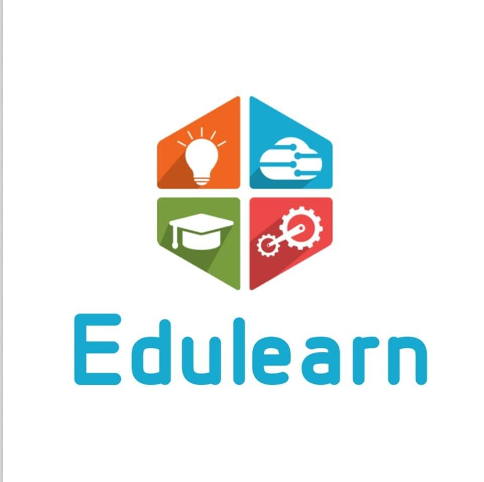

# 🎓 EduLearn

<p align="center">
  
</p>

<h2 align="center">📚 EduLearn – Online Programming Learning Platform</h2>

<p align="center">
  A simple and beginner-friendly educational website for learning programming through courses, notes, examples, and structured learning content.
</p>

---

## 🌟 About The Project

**EduLearn** is an online educational website designed to help students learn programming in a simple and organized way.

The platform provides programming courses along with notes and learning resources. Users can start from the login page, explore available courses, and access topic-wise programming notes.

The project is created using **HTML and CSS**, making it simple and suitable for beginners who are learning web development.

---

## 🚀 Features

- 🔐 Student Login Page
- 🏠 Attractive Home Page
- 📚 Programming Course Cards
- 🔎 Course Search Box
- 📝 Topic-wise Programming Notes
- 💻 C Programming Notes
- 🌐 HTML Notes
- 🎨 CSS Notes
- ⚡ JavaScript Notes
- ☕ Java Programming Course
- 📊 R Programming Course
- 👨‍🏫 Expert Instructor Section
- 📱 Responsive Layout
- 🎓 Beginner-Friendly Learning Content
- 📖 Examples and Code Snippets

---

## 🖥️ Website Pages

### 🔐 1. Student Login

The login page allows students to enter:

- Name
- Date of Birth
- Mobile Number
- Age

After entering the details, the user can continue to the EduLearn homepage.

The page uses a split-screen design with an EduLearn introduction section and student login form. :contentReference[oaicite:2]{index=2}

---

### 🏠 2. Home Page

The homepage contains:

- EduLearn header
- Course search box
- Navigation menu
- Hero section
- Popular courses
- Expert instructors
- How It Works section
- Footer

The project provides courses such as C Programming, Java Programming, HTML, CSS, JavaScript and R. :contentReference[oaicite:3]{index=3} :contentReference[oaicite:4]{index=4}

---

## 📚 Available Courses

| Course | Description |
|--------|-------------|
| 💻 C Programming | Learn variables, loops, arrays, functions, pointers and more |
| ☕ Java Programming | Learn object-oriented programming and Java application concepts |
| 🌐 HTML | Learn HTML structure, tags, lists, links, images, tables and forms |
| 🎨 CSS | Learn styling, selectors, box model, layouts, Flexbox and responsive design |
| ⚡ JavaScript | Learn variables, operators, conditions, loops, functions, arrays and DOM |
| 📊 R Programming | Learn concepts related to statistics, data analysis and visualization |

---

# 💻 C Programming Notes

The C Programming section contains structured notes divided into multiple parts:

- Variables & Operators
- If Else
- Loops
- Pattern Printing
- Functions
- Array
- 2D Array
- String
- Structure

The C notes page provides navigation to these topics along with simple code examples. :contentReference[oaicite:5]{index=5} :contentReference[oaicite:6]{index=6}

### Example

```c
int a = 10;
float b = 5.5;
char c = 'A';
